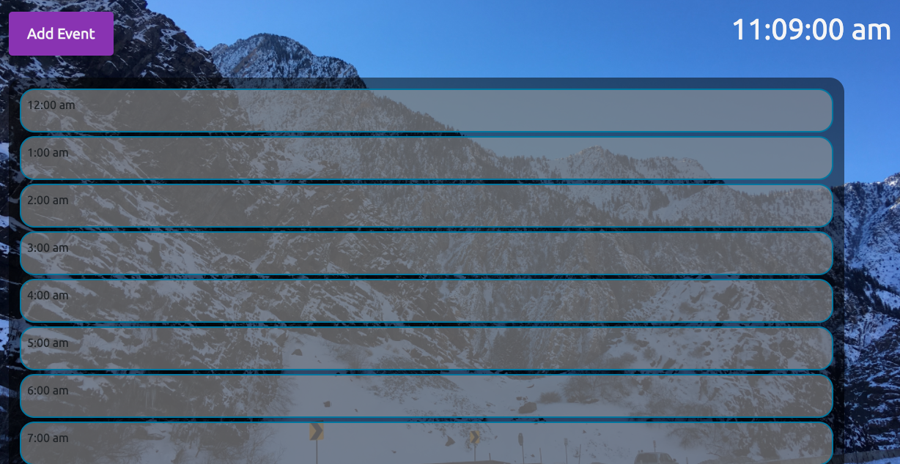

# Name
Homework_5

# Description
This homework builds a daily planner that stores events and displays them in hourly categories. The main features of the site include a live clock, event modal, and time event displays. 

# Usage 
The user should be able to add events to their day and see them fill in on the displayed planner. multiple events should be able to be stacked and overlap time slots. The events will be saved for that day and then wiped at the end of the day (11:59pm) to create a new daily planner for the following day.

# Progress
4/2/20 - The styling and looks of the planner are fully complete except for the actual event divs and their styling. The functionality of the site is still underway. The sorting of events by time still needs to be implemented along with the recall from local storage.

# Images
